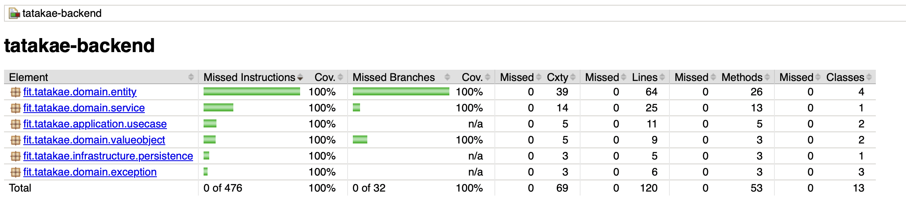

# Tatakae Backend - Core Domain

Anti-fraud training session validation and rep leaderboard domain for **Tatakae**, an iOS calisthenics app that counts repetitions via AI.

> **Academic project.** This repository was built for academic purposes for the Java program, **Talento Ready, Desafío Latam**: **Milestone 1 (Hito 1)** produced the pure domain core, and **Milestone 3 (Hito 3)** restructured it into layered Clean Architecture with tactical DDD patterns. It models, as a learning exercise, what the leaderboard backend for Tatakae could look like — it is not the production backend of the published app.

This repository applies **Clean Architecture** (Domain / Application / Infrastructure) and tactical **Domain-Driven Design** patterns to two bounded features — anti-fraud session validation and rep leaderboard — keeping the business core 100% isolated from frameworks, databases, or external interfaces.

## Package Map

```
fit.tatakae
├── domain                 <-- Zero frameworks (pure Java)
│   ├── entity              User, TrainingSession, Exercise, PrivacyLevel
│   ├── valueobject          RepsCount, SessionTimeframe (records, self-validating)
│   ├── exception            InconsistentSessionException, FraudulentSessionException, InvalidUserException
│   ├── repository           SessionRepository (pure contract interface)
│   └── service              LeaderboardService (domain service)
├── application             <-- Use cases, orchestrates the domain
│   └── usecase               RecordTrainingSessionUseCase, GetLeaderboardUseCase
└── infrastructure          <-- Adapters, technology-specific
    └── persistence          InMemorySessionRepository (SessionRepository implementation)
```

## Architecture Highlights
- **Dependency Rule**: outer layers depend on inner layers, never the reverse. `domain` and `application` have zero imports of frameworks, databases, or `infrastructure` classes.
- **Tactical DDD**: `TrainingSession` and `User` are Entities with a unique `id` that persists across attribute changes (`equals`/`hashCode` compare by id only, never by attributes); `RepsCount` and `SessionTimeframe` are immutable Value Objects (Java `record`) that self-validate in their compact constructor, rejecting invalid data at instantiation.
- **Behavior-Rich Entities**: business rules live inside the entities that own them instead of leaking into services — `User.isPublic()` / `isFromCountry(...)`, `TrainingSession.isForExercise(...)` / `outperforms(...)` replace anemic getter comparisons that used to sit in `LeaderboardService`.
- **Repository Pattern**: `SessionRepository` is a pure interface defined in `domain.repository`. `InMemorySessionRepository` (in `infrastructure.persistence`) is its only implementation — swapping storage technology never touches the domain.
- **Constructor Injection Only**: Use cases (`RecordTrainingSessionUseCase`, `GetLeaderboardUseCase`) receive their dependencies exclusively through the constructor. No `new ConcreteRepository()` is ever called inside a use case.
- **English Nomenclature**: Clean, modular code entirely in English, including exception messages.

## Testing & Quality Assurance
This project uses **JUnit 5** and **Mockito** to ensure the highest standards of quality.
- **Rigorous AAA Pattern**: All tests are strictly structured using Arrange, Act, and Assert phases.
- **Business Exceptions**: Custom exceptions (`InconsistentSessionException`, `FraudulentSessionException`, `InvalidUserException`) are verified with `assertThrows`.
- **Mocked Dependencies**: `SessionRepository` and `LeaderboardService` are stubbed with Mockito (`when(...).thenReturn(...)`) and verified with `verify(...)` to isolate each unit under test from its collaborators.
- **Parameterized Tests**: Data-driven testing is used to reduce duplication (e.g. `@ValueSource`, `@NullAndEmptySource`).
- **100% Coverage Enforced**: The test suite guarantees 100% Line and Branch coverage across every package, domain and application and infrastructure alike, ensuring no orphan logic exists.

## How to Verify
To compile and check the project:

```bash
mvn clean compile
```

To run the automated tests and generate the JaCoCo coverage report:

```bash
mvn clean test jacoco:report
```

After running the command, you can view the coverage evidence by opening the generated HTML report:
`target/site/jacoco/index.html`

## Coverage Evidence

100% line and branch coverage across the whole project (476/476 instructions, 32/32 branches):


